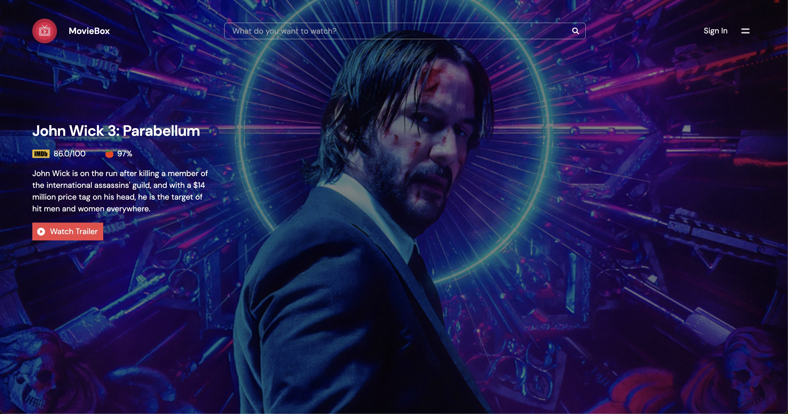

# hng_task2

This is a movie discovery web application that allows users to search for movies, view movie details, and save their favorite movies. It consumes movie data from the TMDB API.



## Table of Contents

- [Features](#features)
- [Demo](#demo)
- [Getting Started](#getting-started)
  - [Prerequisites](#prerequisites)
  - [Installation](#installation)
- [Usage](#usage)
- [API Key](#api-key)
- [Contributing](#contributing)
- [License](#license)

## Features

- **Homepage:** Displays the top 10 rated movies with movie posters, titles,release dates and popularity.
- **Movie Search:** Allows users to search for movies by title, displaying search results.
- **Movie Details Page:** Provides detailed information about a selected movie, including title, release date, overview, and poster image.
- **Error Handling:** Displays meaningful error messages in case of API failures or other issues.

## Demo

You can see a live demo of this application here: [Movie Discovery App Demo]()

## Getting Started

Follow these instructions to get the project up and running on your local machine.

### Prerequisites

- Node.js and npm installed on your machine.
- TMDB API key. You can obtain one by signing up at [https://www.themoviedb.org](https://www.themoviedb.org) and creating an API key.

### Installation

1. Clone the repository to your local machine:

   ```bash
   git clone https://github.com/okorieonyedikachi/hng_task2